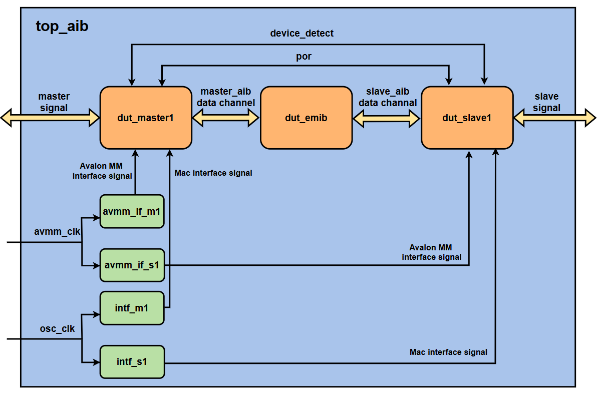
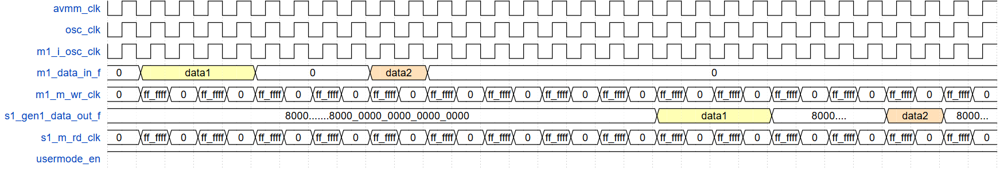
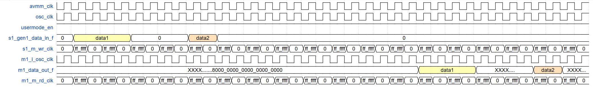
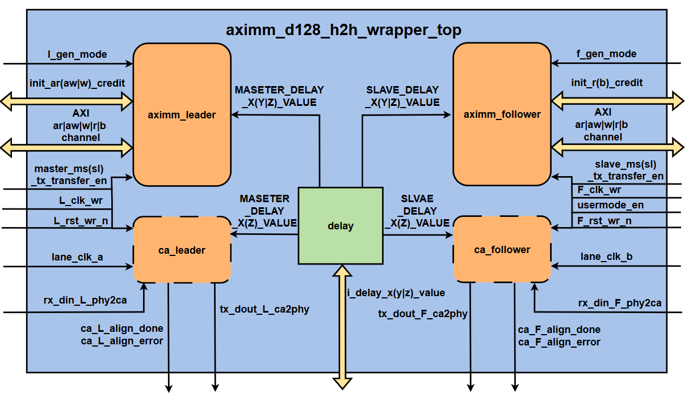
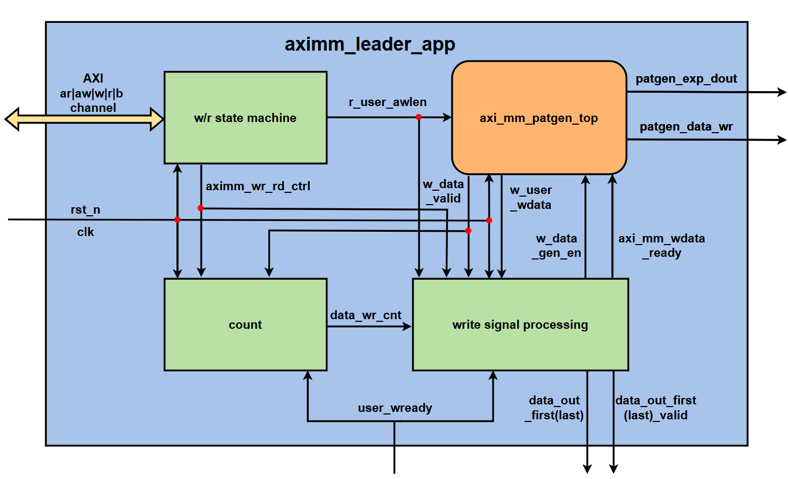
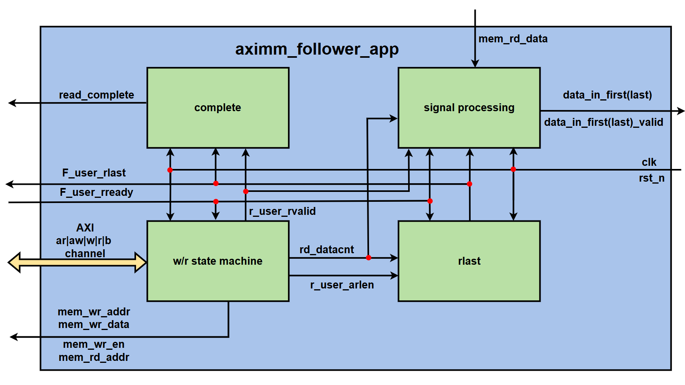
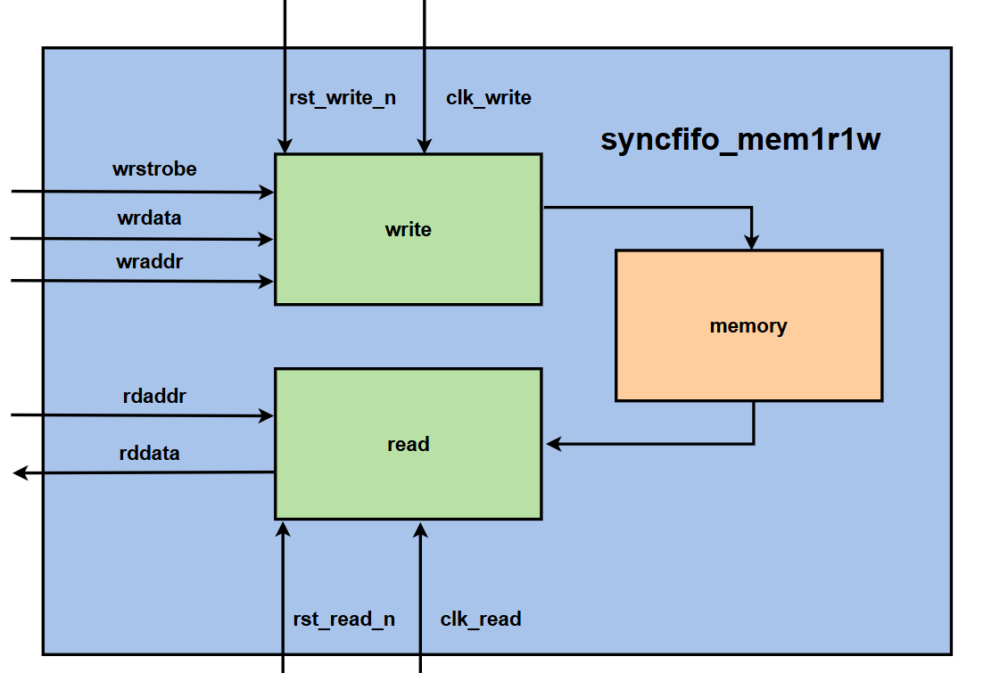

# axi_mm_a32_d128模块功能描述

### top_aib模块
1. **模块架构图**:
    
2. **模块功能**:
    - 该模块是负责实例化aib的主机和从机模块，并将主机和从机的数据通道进行连接。含测试文件可进行仿真测试
3. **参数与宏定义配置**:
    |参数 | 描述 |
    | :----: | :----:|
    | DWIDTH | 数据宽度 |
    | TOTAL_CHNL_NUM | 通道数量 |

    | 宏定义 | 描述 |
    | :----: | :----: |
    | MS_AIB_GEN1 | 开启主机GEN1模式,定义该参数主机**master_aib**通道位数为**96**位，若未定义该参数主机**master_aib**通道位数为**102**位 |
    | SL_AIB_GEN1 | 开启从机GEN1模式,定义该参数从机**slave_aib**通道位数为**96**位，若未定义该参数从机**slave_aib**通道位数为**102**位|
4. **信号**:
    |  信号   |I/O| 描述  |
    |  :----:  | :----:  |:----:  |
    | avmm_clk | I |  Avalon MM 时钟信号 |
    | osc_clk  | I |  Mac 接口的leader振荡器时钟,接入intf接口后未被使用 | 
    |**主机信号**|
    | m1_data_in_f | I | 外部传入数据，接入到dut_master1的FIFO模式数据输入通道data_in_f |
    | m1_data_out_f | O | dut_master1的FIFO模式数据输出通道data_out_f 输出到外部| 
    | m1_data_in  | I | 外部传入数据，接入到dut_master1的寄存器模式数据输入通道data_in | 
    | m1_data_out | O | dut_master1的寄存器模式数据输出通道data_out 输出到外部 |
    | m1_m_ns_fwd_clk | I | 主机近端到远端传输时钟信号，接入到dut_master1的m_ns_fwd_clk |
    | m1_m_ns_rcv_clk | I | 主机近端到远端接收时钟信号，接入到dut_master1的m_ns_rcv_clk |
    | m1_m_fs_rcv_clk | O | 主机远端到近端接收时钟信号，接入到dut_master1的m_fs_rcv_clk |
    | m1_m_fs_fwd_clk | O | 主机远端到近端传输时钟信号，接入到dut_master1的m_fs_fwd_clk |
    | m1_m_wr_clk | I | 主机FIFO写数据时钟信号，接入到dut_master1的m_wr_clk |
    | m1_m_rd_clk | I | 主机FIFO读数据时钟信号，接入到dut_master1的m_rd_clk |
    | m1_ms_tx_transfer_en | O | 主机leader的TX通道完成校准准备接收数据,接入到dut_master1的ms_tx_transfer_en |
    | m1_ms_rx_transfer_en | O | 主机leader的RX通道完成校准准备接收数据,接入到dut_master1的ms_tx_transfer_en |
    | m1_sl_tx_transfer_en | O | 主机follower的TX通道完成校准准备接收数据,接入到dut_master1的sl_tx_transfer_en |
    | m1_sl_rx_transfer_en | O | 主机follower的RX通道完成校准准备接收数据,接入到dut_master1的sl_rx_transfer_en |
    | m1_i_osc_clk | I |  振荡器时钟信号，用于同步leader接口,仅用于master模式，接入到dut_master1的i_osc_clk|
    | m1_por_out | O | 电源复位信号| 
    |**从机信号**|
    | usermode_en | O | 信号来自dut_slave1.u_maib_0.usermode_in，该信号在延迟2000ns后置1进入用户模式 |
    | s1_gen1_data_in_f | I | 外部传入数据，接入到dut_slave1的寄存器模式数据输入通道data_in_f(tx_parallel_data | data_in) |
    | s1_gen1_data_out_f | O | 外部传入数据，接入到dut_slave1的寄存器模式数据输入通道data_out_f(rx_parallel_data | data_out) |
    | s1_m_wr_clk | I | 写数据时钟信号，接入到dut_slave1的m_wr_clk(tx_coreclkin) |
    | s1_m_rd_clk | I | 读数据时钟信号, 接入到dut_slave1的m_rd_clk(rx_coreclkin) |
    | s1_m_ns_fwd_clk | I | 远端到近端传输时钟信号,接入到dut_slave1的m_ns_fwd_clk |
    | s1_m_fs_fwd_clk | O | 近端到远端传输时钟信号,接入到dut_slave1的m_fs_fwd_clk |
    | s1_ms_rx_transfer_en | O | leader的RX通道完成校准，准备接收数据,接入到dut_slave1的ms_rx_transfer_en|
    | s1_ms_tx_transfer_en | O | leader的TX通道完成校准，准备接收数据,接入到dut_slave1的ms_tx_transfer_en|
    | s1_sl_rx_transfer_en | O | follower的RX通道完成校准，准备接收数据,接入到dut_slave1的sl_rx_transfer_en|
    | s1_sl_tx_transfer_en | O | follower的TX通道完成校准，准备接收数据,接入到dut_slave1的sl_tx_transfer_en|
5. **主从数据传输信号图**:
   - **主机发送从机接收**:
    
        - 数据从顶层传入主机的m1_data_in_f再传输到从机的s1_gen1_data_out_f最后输出到顶层。
        - data1从主机发送，到从机接收到数据需经过9个m1_m_wr_clk(s1_m_rd_clk)时钟周期。
        - 从机接收的数据需要将第79位、159位、239位...置0可得到主机发送的数据。
        即data1(从机) - 0x8000_0000_0000_0000_0000_8000_..._8000_0000_0000_0000_0000 = data1(主机)
   - **从机发送主机接收**:
     
        - 数据从顶层传入从机的s1_gen1_data_in_f再传输到主机的m1_data_out_f最后输出到顶层。
        - data1从从机发送，到主机接收到数据需经过12个s1_m_wr_clk(m1_m_rd_clk)时钟周期。
        - 主机接收的数据需要将第319位、639位、959位...置0可得到从机发送的数据。
        即data1(主机) - 0xXXXX_XXXX_..._8000_0000_0000_0000_0000_...XXXX_XXXX_XXXX_XXXX_XXXX_XXXX_XXXX_XXXX_XXXX_XXXX_XXXX_XXXX_XXXX_XXXX_XXXX__8000_0000_0000_0000_0000 = data1(从机)
#### dut_master1子模块
1. **模块功能**:
    - 该模块是AIB主设备端模块，通过不同参数配置可配置GEN1和GEN2等模式,选择实例化为物理层或者其他层次的模块
2. **宏定义配置**:
    | 宏定义 | 描述 |
    | :----: | :----: |
    | MS_AIB_GEN1 | 开启主机GEN1模式，调用的是[aib_top_wrapper_v1m][1]模块进行实例化|
    | MS_AIB_BCA | 在无 MS_AIB_GEN1 时 调用的是[aib_phy_top][2]模块进行实例化,实例化为aib物理层接口。若两参数均未定义，调用的是[aib_module_top][10]模块进行实例化,实例化为aib其他层次的模块。 |
    | SL_AIB_GEN1 | 在无MS_AIB_GEN1定义时，选择关闭GEN2模式 |

3. **信号**:
    |  信号   |I/O| 描述  |
    |  :----:  | :----:  |:----:  |
    |**数据通道与IO信号**|
    | iopad_ch(n)_aib |I/O| 主机双向aib数据通道，n为0-23  |
    | data_in(out)_f |I (O)| FIFO模式的输入输出 |
    | data_in(out) |I (O)| 寄存器模式的输入输出 |
    |**时钟信号**|
    | m_ns_fwd_clk |I| 近端到远端传输时钟信号 |
    | m_ns_rcv_clk |I| 近端到远端接收时钟信号 |
    | m_fs_fwd_clk |O| 远端到近端传输时钟信号 | 
    | m_fs_rcv_clk |O| 远端到近端接收时钟信号 |
    | m_wr_clk |I| FIFO写数据时钟信号 |
    | m_rd_clk |I| FIFO读数据时钟信号 |
    | i_osc_clk |I| 振荡器时钟信号，用于同步leader接口 |
    |**校准完成信号** | 
    | ms_tx_transfer_en |O| leader的TX通道完成校准，准备接收数据 |
    | ms_rx_transfer_en |O| leader的RX通道完成校准，准备接收数据 |
    | sl_tx_transfer_en |O| follower的TX通道完成校准，准备接收数据 |
    | sl_rx_transfer_en |O| follower的RX通道完成校准，准备接收数据 |
    |**其他**|    
    | o_m_power_on_reset |O| 电源复位信号 |
    |**AVMM/mac接口只在内部连接故省略**|

#### dut_slave1子模块
1. **模块功能**:
    - 该模块是AIB从设备端模块，通过不同参数配置可配置GEN1和GEN2等模式,选择实例化为物理层或者其他层次的模块
2. **宏定义配置**:
    | 宏定义 | 描述 |
    | :----: | :----: |
    | SL_AIB_GEN1 | 开启从机GEN1模式 |
    | MAIB_REV1DOT1 | 在开启GEN1模式后，调用的是[maib_top][6]进行实例化,在模块中调用aib辅助模块[aib_aux_channel][16]实例化,同时时会include [maib_prog_rev1.1.inc][8]。若未定义该参数则 调用的是[maib_top_96pin][5]进行实例化,同时会include [maib_prog.inc][9]| 
    | MS_AIB_BCA | 在无 MS_AIB_GEN1 时 调用的是[aib_phy_top][2] [dut_sl1_bca.inc][7]模块进行实例化,实例化为aib物理层接口。若参数均未定义，调用的是[aib_module_top][10] [dut_sl1_port.inc][11]模块进行实例化,实例化为aib其他层次的模块。|
    | MS_AIB_GEN1 | 在无SL_AIB_GEN1定义时，选择关闭GEN2模式 |
3. **信号**:
    |  信号   |I/O| 描述  |
    |  :----:  | :----:  |:----:  |
    |**数据通道与IO信号**|
    | iopad_aib_ch(n) |I/O| 从机双向aib数据通道，n为0-23  |
    | data_in(out)_f |I (O)| 定义 MAIB_REV1DOT1 时的输入输出信号 |
    | tx(rx)_parallel_data | I (O) | 未定义 MAIB_REV1DOT1 时的输入输出信号 |
    |**时钟信号**|
    | m_fs_fwd_clk |O| 远端到近端传输时钟信号 | 
    | m_wr_clk |I| 定义 MAIB_REV1DOT1 时的写数据时钟信号 |
    | m_rd_clk |I| 定义 MAIB_REV1DOT1 时的读数据时钟信号 |
    | tx_coreclkin |I| 未定义 MAIB_REV1DOT1 时的写数据时钟信号 |
    | rx_coreclkin |I| 未定义 MAIB_REV1DOT1 时的读数据时钟信号 |
    | m_ns_fwd_clk |I| 未定义 MAIB_REV1DOT1 时的近端到远端传输时钟信号 |
    |**校准完成信号** | 
    | ms_tx_transfer_en |O| leader的TX通道完成校准，准备接收数据 |
    | sl_tx_transfer_en |O| follower的TX通道完成校准，准备接收数据 |
    | ms_rx_transfer_en |O| 未定义 MAIB_REV1DOT1 时的leader的RX通道完成校准，准备接收数据 |
    | sl_rx_transfer_en |O| 未定义 MAIB_REV1DOT1 时的follower的RX通道完成校准，准备接收数据 |
    |**AVMM/mac接口只在内部连接故省略,若无定义SL_AIB_GEN1 dut_slave1的信号参考dut_master1信号**|
#### dut_emXXXX_XXXX_
1. **模块功能**:
    - 该模块是AIB主从通道对接模块，根据不同的主机和从机模式选择不同的对接模块进行实例化
2. **宏定义配置**:
    | 宏定义 | 描述 |
    | :----: | :----: |
    | MS_AIB_GEN1 | 定义该参数后调用的是[emib_m1s2][3] [dut_emib.inc][12]模块进行实例化,该模块是主机GEN1从机GEN2，主机通道宽度为96位，从机通道宽度为102位|
    | SL_AIB_GEN1 | 若未定义MS_AIB_GEN1,调用的是[emib_m2s1][4] [dut_emib.inc][12]模块进行实例化,该模块是主机GEN2从机GEN1，主机通道宽度为102位，从机通道宽度为96位。若两参数均未定义,调用的是[emib_m2s2][13] [dut_emib.inc][12]模块进行实例化,该模块是主机GEN2从机GEN1,主机通道宽度为102位,从机通道宽度为102位。|
#### [avmm_if_m1(s1)][14]接口
1. **接口功能**:
    -实例化Avalon MM 的主从接口,用于下面dut_master1和dut_slave1模块内
2. **宏定义配置**:
    | 宏定义 | 描述 |
    | :----: | :----: |
    | AVMM_WIDTH | 接口数据宽度参数 |
    | BYTE_WIDTH | 控制字节使能信号的宽度参数 |
3. **信号**:
    |  信号   |I/O| 描述  |
    |  :----:  | :----:  |:----:  |
    | clk | I | 接入顶层的avmm_clk信号 |
#### [intf_m1(s1)][15]接口
1. **接口功能**:
    -实例化Mac 的主从接口,用于下面dut_master1和dut_slave1模块内
2. **宏定义配置**:
    | 宏定义配置 | 描述 |
    | :----: | :----: |
    | DWIDTH | 接口数据宽度参数 |
3. **信号**:
    |  信号   |I/O| 描述  |
    |  :----:  | :----:  |:----:  |
    | osc_clk | I | 仅用于leader的振荡器时钟  |
    | 另外3个时钟信号均被赋值为 0 |

#### 测试文件
1.  **agent.sv**:
    -文件位于生成目录的common目录下。该文件是用于测试的文件，文件中定义了多个task用于测试
2. **test.inc**
    -文件位于生成目录的common目录下。该文件是用于测试的文件，文件中调用了agent.sv中的task进行测试

### aximm_d128_h2h_wrapper_top模块
1. **模块架构图**:
    
2. **模块功能**:
    - axi主从模块的初始化，模块有单双通道配置、延迟值输入用于时钟域同步，同时还有多个状态信号用于调试但是在本模块中空接了
3. **参数配置**:
    | 参数 | 描述 |
    | :----: | :----: |
    | AXI_CHNL_NUM | 当参数为1时为单通道模式，当参数不为为1时为双通道模式。当参数为2时实例化子模块ca用于多通道的数据对齐，时钟同步和FIFO状态检测|
4. **信号**:
    |  信号   |I/O| 描述  |
    |  :----:  | :----:  |:----:  |
    | L(F)_clk_wr | I | leader(follower)读写时钟信号 |
    | L(f)_rst_wr_n | I | leader(follower)低电平有效复位信号 |
    | por_in | I | 系统电源复位信号 |
    | lane_clk_a(b) | I | leader(follower)的多通道时钟信号数组 |
    | init_ar(aw/w)_credit | I | aximm_leader的初始信贷值，用于流量控制 |
    | init_r(b)_credit | I | aximm_follower 的初始信贷值，用于流量控制 |
    | usermode_en | I | 启用用户模式,影响各模块的复位模式 |
    | tx_ar(aw/w)_debug_status | O | 发送端ar(aw/w)通道状态信号,用于调试,但是这3个信号在该模块中空接 |
    | rx_r(b)_debug_status | O | 接收端(r/b)通道状态信号,用于调试,但是这2个信号在该模块中空接 |    
    | l(f)_gen_mode | I | leader(follower)是否开启GEN2模式 |
    | i_delay_x(y/z)_value | I |  3个延迟值用于同步时钟域 | 
    | master_sl(ms)_tx_transfer_en | I | 两信号控制aximm_leader的tx(rx)_online信号是否启动 |
    | slave_sl(ms)_tx_transfer_en | I | 两信号控制aximm_follower的tx(rx)_online信号是否启动 |
    | tx_dout_L(F)_ca2phy | O | leader(follower)的ca子模块到物理层的传输数据输出 |
    | rx_din_L(F)_phy2_ca | I | 物理层到leader(follower)的ca子模块的接收数据 |
    | ca_L(F)_align_done | O | ca_leader(follower)子模块对齐完成标志信号 |
    | ca_L(F)_align_error | O | ca_leader(follower)子模块对齐异常信号 |
    | leader与follower 的 ar aw w r b 通道的信号不做介绍| |[axi中文手册][18]| |

#### aximm_leader子模块
1. **模块功能**:
    - 该模块调用了axi_mm_master_top(生成的)实例化了AXI主机接口，同时该模块可以控制信号延迟，开启GEN2模式，信用信号控制数据流，状态信号用于调试
2. **参数配置**:
    | 参数 | 描述 |
    | :----: | :----: |
    | AXI_CHNL_NUM | 当参数为1时为单通道模式，当不为1时为双通道模式在实例化时多开启一条物理通道|

3. **信号**:
    |  信号   |I/O| 描述  |
    |  :----:  | :----:  |:----:  |
    |  clk_wr | I | 读写时钟信号 |
    | rst_wr_n | I | 低电平有效复位信号 |
    | tx(rx)_online | I | 发送(接收)通道是否在线，即是否正常工作|
    | init_r(b)_credit | I | 初始化信用信号,用于r(b)数据流控制 |
    | tx_phy0(1) | O | 物理层发送数据通道0(1),当为双通道时开启通道1,数据宽度为80位 | 
    | rx_phy0(1) | I | 物理层接收数据通道0(1),当为双通道时开启通道1,数据宽度为80位 | 
    | AR信号，aw信号，w信号，r信号，b信号不做介绍| | [axi中文手册][18]|
    | tx_ar(aw/w)_debug_status | O | 发送端ar(aw/w)通道状态信号,用于调试,但是这3个信号在该模块中未接入顶层信号 |
    | rx_r(b)_debug_status | O | 接收端(r/b)通道状态信号,用于调试,但是这2个信号在该模块中未接入顶层信号 |    
    | m_gen2_mode | I | 因该是主机GEN2模式，但是该模块里面接入该信号的子模块中这个信号空接 |
    | delay_x(y/z)_value | I | 3个延迟值用于同步时钟域 |

#### aximm_follower子模块
1. **模块功能**:
    - 该模块调用了axi_mm_slave_top(生成的)实例化了AXI从机接口，同时该模块可以控制信号延迟，开启GEN2模式，信用信号控制数据流，状态信号用于调试
2. **参数配置**:
    | 参数 | 描述 |
    | :----: | :----: |
    | AXI_CHNL_NUM | 当参数为1时为单通道模式，当不为1时为双通道模式在实例化时多开启一条物理通道|

3. **信号**:
    |  信号   |I/O| 描述  |
    |  :----:  | :----:  |:----:  |
    |  clk_wr | I | 读写时钟信号 |
    | rst_wr_n | I | 低电平有效复位信号 |
    | tx(rx)_online | I | 发送(接收)通道是否在线，即是否正常工作|
    | init_ar(ar/w)_credit | I | 初始化信用信号,用于ar(aw/w)数据流控制 |
    | tx_phy0(1) | O | 物理层发送数据通道0(1),当为双通道时开启通道1,数据宽度为80位 | 
    | rx_phy0(1) | I | 物理层接收数据通道0(1),当为双通道时开启通道1,数据宽度为80位 | 
    | AR信号，aw信号，w信号，r信号，b信号不做介绍| |[axi中文手册][18]|
    | tx_ar(aw/w)_debug_status | O | 发送端ar(aw/w)通道状态信号,用于调试,但是这3个信号在该模块中未接入顶层信号 |
    | rx_r(b)_debug_status | O | 接收端(r/b)通道状态信号,用于调试,但是这2个信号在该模块中未接入顶层信号 |
    | m_gen2_mode | I | 因该是主机GEN2模式，但是该模块里面接入该信号的子模块中这个信号空接 |
    | delay_x(y/z)_value | I | 3个延迟值用于同步时钟域 |

#### ca_leader和ca_follower子模块
1. **模块功能**:
    - 该模块调用了[ca][17]模块进行实例化，当AXI_CHNL_NUM为2时，该模块才会被实例化。该模块用于多通道的数据对齐，时钟同步和FIFO状态检测
2. **参数配置**:
    | 参数 | 描述 |
    | :----: | :----: |
    | NUM_CHANNELS | 通道数量 |
    | BITS_PER_CHANNEL | 通道位宽 | 
    | AD_WIDTH | 地址宽度 |
    | SYNC_FIFO | 是否启用同步FIFO |
3. **信号**:
    |  信号   |I/O| 描述  |
    |  :----:  | :----:  |:----:  |
    | lane_clk | I | 多通道时钟信号数组 | 
    | com_clk | I | 公共时钟用于同步 | 
    | rst_n | I | 异步低电平有效复位信号 |
    | tx(rx)_online | I | 发送(接收)方是否在线信号 |
    | tx_stb_en | I | 控制ca_tx_strb_i子模块是否生成strobe信号 |
    | tx_stb_rcvr | I | 指示ca_tx_strb_i子模块处于接收还是生成strobe信号 |  
    | align_fly | I |  控制ca_rx_align_i子模块是否进行数据对齐 | 
    | rden_dly | I | 3位宽控制ca_rx_align_i子模块的FIFO读操作延迟 | 
    | delay_x(z)_value | I | 可配置的延迟值用于延迟控制 |
    | tx(rx)_stb_wd_sel | I | 选择发送(接收)数据流中的一个字节并指示其在数据流中的位置 |
    | tx(rx)_stb_bit_sel | I | 用于进一步选择发送(接收)数据流中的一个字节中的特定位 |
    | tx(rx)_stb_intv | I | 用于控制发送(接收)数据的时序 |
    | tx(rx)_din | I | 发送(接收)子模块的数据输入通道 |
    | tx(rx)_dout | O | 发送(接收)子模块的数据输出通道 |
    | align_done | O | ca_rx_align_i子模块对齐完成标志信号 |
    | align_err | O | ca_rx_align_i子模块对齐异常信号 |
    | fifo_full_val | I | FIFO缓存满状态的阈值 |
    | fifo_pfull_val | I | FIFO缓存接近满状态的阈值 |
    | fifo_empty_val | I | FIFO缓存空状态的阈值 |
    | fifo_pempty_val | I | FIFO缓存接近空状态的阈值 |
    | fifo_full | O | FIFO是否已满,空接 |
    | fifo_pfull | O | FIFO是否近满 ,空接| 
    | fifo_empty | O | FIFO是否已空,空接 |
    | fifo_pempty| O| FIFO是否近空,空接 |

### aximm_leader_app模块
1. **模块架构图**:
    
    **注：**
    | 代码块 | 介绍 |
    | :----: | :----: |
    | w/r_state_machine | 读写状态机用来选择读或者写操作 | 
    | count | 写操作计数器 |
    | write signal processing | 写操作信号处理，处理后输出data_out_first(last)和data_out_first(last)_valid |
2. **模块功能**:
    - 本模块是AXI-leader接口测试模块，模拟AXI-leader通过读写状态机(w/r_state_machine)选择写或读操作，该模块可选择3种不同模式生成AXI数据同时提供监控信号方便AXI总线的测试
3. **参数配置**:
    | 参数 | 描述 |
    | :----: | :----: |
    | AXI_CHNL_NUM | AXI通道数量 | 
    | DWIDTH | 数据总线宽度 |
    | ADDRWIDTH | 地址总线宽度 |
4. **信号**:
    |  信号   |I/O| 描述  |
    |  :----:  | :----:  |:----:  |
    | clk | I | 模块时钟信号 |
    | rst_n | I | 低电平有效复位信号 |
    | axi_rw_length | I | AXI读写传输的长度,由axi_wr(rd)决定是读还是写通道的信号 |
    | axi_rw_burst| I | AXI突发传输类型,由axi_wr(rd)决定是读还是写通道的信号,在模块内部未使用 | 
    | axi_rw_size | I | AXI突发传输大小,由axi_wr(rd)决定是读还是写通道的信号,在模块内部未使用 |
    | axi_rw_addr | I | AXI读写地址,由axi_wr(rd)决定是读还是写通道的信号 | 
    | axi_wr(rd) | I | AXI写(读)操作请求信号 |
    | patgen_data_wr| O | 数据写使能信号，使能时代表数据将被写入FIFO。接入axi_mm_patgen_top子模块|
    | patgen_exp_dout | O |  axi_mm_patgen_top子模块输出的期望测试数据 |
    | data_out_first(last) | O | 写操作时 发送的 第一组(最后一组)数据 |
    | data_out_first(last)_valid | O | 指示 data_out_first(last) 信号输出的数据是否有效 |
    | write_complete | O | 写操作完成信号 |
    | AR信号，aw信号，w信号，r信号，b信号不做介绍| |[axi中文手册][18]|

#### [axi_mm_patgen_top][19]子模块
1. **模块功能**:
    -该模块是一个AXI接口的模式生成器,可以产生随机数据、递增数据或固定模式的数据流通过FIFO进行缓冲和传输
2. **参数配置**:
    | 参数 | 描述 |
    | :----: | :----: |
    | LEADER_MODE | leader模式,控制随机生成模块(aximm_rand_gen)和递增生成模块(aximm_incr_gen)输出的数据位宽 | 
    | AXI_CHNL_NUM | AXI通道数量 |
3. **信号**:
    |  信号   |I/O| 描述  |
    |  :----:  | :----:  |:----:  |
    | wr_clk | I | 写时钟信号 |
    | rst_n | I | 低电平有效复位信号 |
    | cntuspatt_en | I | 启用增量计数器生成测试模式信号|
    | patgen_en | I | 生成器使能信号 |
    | patgen_sel | I | 模式选择信号，00为固定模式，固定发送同组数据、01为随机模式、10为递增模式|
    | patgen_cnt | I | 设置生成器递增模式的计数最大值 |
    | patgen_dout | O | 生成的测试数据 |
    | patgen_exp_dout | O | 期望的测试数据 |
    | patgen_data_wr | O | 数据写使能信号，使能时代表数据将被写入FIFO |
    | chkr_fifo_full | I | FIFO是否已满信号 |
    | axist_valid | O | AXI通道有效信号|
    | axist_rdy | I | AXI通道就绪信号|

### aximm_follower_app模块
1. **模块架构图**:
    
    **注：**
    | 代码块 | 介绍 |
    | :----: | :----: |
    | w/r_state_machine | 读写状态机用来选择读或者写操作 | 
    | rlast | 判断数据流的结束，用于后续data_in_last和data_in_last_valid的输出 |
    | complete | 判断读操作是否完成，输出read_complete信号|
    | signal processing | 信号处理处理后输出data_in_first(last)和data_in_first(last)_valid |
2. **模块功能**:
    - 本模块是AXI-follower接口模块,通过状态机控制读取顶层内存模块数据还是向指定内存地址写入数据,同时该模块中会保存数据流中的首尾部数据。
3. **参数配置**: 
    | 参数 | 描述 |
    | :----: | :----: |
    | AXI_CHNL_NUM | AXI通道数量 | 
    | DWIDTH | 数据总线宽度 |
    | ADDRWIDTH | 地址总线宽度 |
4. **信号**:
    |  信号   |I/O| 描述  |
    |  :----:  | :----:  | :----:  |
    | clk | I | 模块时钟信号 |
    | rst_n | I | 低电平有效复位信号 |
    | read_complete | O | 读操作完成信号 |
    | mem_wr_addr | O | 内存写地址信号，在写操作阶段会被设置为当前内存写入地址接入到顶层内存模块中 |
    | mem_wr_data | O | 内存写数据信号，在写操作阶段将要写入的数据存入，传输到顶层内存模块中|
    | mem_wr_en  | O | 内存写使能信号，控制顶层内存模块写操作是否有效 |
    | mem_rd_data | I | 从顶层内存模块中读取的数据，接入到F_user_rdata  |
    | mem_rd_addr | O | 内存读地址信号，读取的指定内存地址的数据，传输到顶层内存模块中|
    | data_in_first(last) | O | 读取内存时的第一组(最后一组)数据 |
    | data_in_first(last)_valid | O | 指示 data_in_first(last) 信号输出的数据是否有效 |
    | AR信号，aw信号，w信号，r信号，b信号不做介绍| |[axi中文手册][18]|

### syncfifo_mem1r1w模块
1. **模块架构图**:
    
    **注：**
    | 代码块 | 介绍 |
    | :----: | :----: |
    | write | 写操作部分 |
    | read | 读操作部分 |
    | memory | 存储部分|
2. **模块功能**:
    - 该模块是一个 同步 FIFO存储器，有一个读端口和一个写端口。可在两个不同的时钟域中同步读取与写入数据，同时支持FPGA仿真与实际硬件。
3. **参数与宏定义配置**: 
    | 参数 | 描述 |
    | :----: | :----: |
    | FIFO_WIDTH_WID | FIFO数据宽度 |
    | FIFO_DEPTH_WID| FIFO深度 |
    | FIFO_ADDR_WID | FIFO地址宽度，根据FIFO深度计算 |

    | 宏定义 | 描述 |
    | :----: | :----:|
    |FPGA | 如果定义则是在FPGA仿真中写操作和读操作的逻辑会在时钟的上升沿同步进行，若未定义则使用 always_ff 语句来同步数据|
4. **信号**:
    |  信号   |I/O| 描述  |
    |  :----:  | :----:  | :----:  |
    | clk_write | I | 写操作时钟信号|
    | rst_write_n | I | 写操作低电平复位信号|
    | clk_read | I | 读操作时钟信号| 
    | rst_read_n | I | 读操作低电平复位信号|
    | wrstrobe | I | 写操作使能信号由aximm_follower_app模块传入|
    | wrdata | I | 写入数据由aximm_follower_app模块传入| 
    | wraddr | I | 写地址由aximm_follower_app模块传入|
    | rdaddr| I | 读地址由aximm_follower_app模块传入| 
    | rddata | O | 读数据传入aximm_follower_app模块|

[1]:https://github.com/chipsalliance/aib-phy-hardware/blob/master/v1.0/rev2/rtl/v1_master/c3aibadapt_wrap/rtl/aib_top_wrapper_v1m.sv
[2]:https://github.com/chipsalliance/aib-phy-hardware/blob/master/v2.0/rev1.1/rtl/bca/src/rtl/aib_top/aib_phy_top.v
[3]:https://github.com/chipsalliance/aib-phy-hardware/blob/master/v2.0/rev1/dv/emib/emib_ch_m1s2.sv
[4]:https://github.com/chipsalliance/aib-phy-hardware/blob/master/v2.0/rev1/dv/emib/emib_ch_m2s1.sv
[5]:https://github.com/chipsalliance/aib-phy-hardware/blob/master/v1.0/rev2/rtl/v1_slave/s10aib/rtl/maib_top_96pin.sv
[6]:https://github.com/chipsalliance/aib-phy-hardware/blob/master/v2.0/rev1.1/rtl/maib_rev1.1/maib_top_96pin.sv
[7]:https://github.com/chipsalliance/aib-phy-hardware/blob/master/v2.0/rev1.1/dv/interface/dut_sl1_bca.inc
[8]:https://github.com/chipsalliance/aib-phy-hardware/blob/master/v2.0/rev1.1/dv/test/data/maib_prog_rev1.1.inc
[9]:https://github.com/chipsalliance/aib-phy-hardware/blob/master/v2.0/rev1/dv/test/data/maib_prog.inc
[10]:https://github.com/chipsalliance/aib-phy-hardware/blob/master/v2.0/rev1/rtl/aib_model_top.v
[11]:https://github.com/chipsalliance/aib-phy-hardware/blob/master/v2.0/rev1/dv/interface/dut_sl1_port.inc
[12]:https://github.com/chipsalliance/aib-phy-hardware/blob/master/v2.0/rev1/dv/interface/dut_emib.inc
[13]:https://github.com/chipsalliance/aib-phy-hardware/blob/master/v2.0/rev1/dv/emib/emib_ch_m2s2.sv
[14]:https://github.com/chipsalliance/aib-phy-hardware/blob/master/v2.0/rev1/dv/interface/avalon_mm_if.sv
[15]:https://github.com/chipsalliance/aib-phy-hardware/blob/master/v2.0/rev1/dv/interface/dut_if_mac.sv
[16]:https://github.com/chipsalliance/aib-phy-hardware/blob/master/v2.0/rev1/rtl/aib_aux_channel.v
[17]:https://github.com/chipsalliance/aib-protocols/blob/main/ca/rtl/ca.sv
[18]:https://github.com/lizhirui/AXI_spec_chinese/blob/main/AXI%E6%80%BB%E7%BA%BF%E6%80%BB%E7%BB%93.md
[19]:https://github.com/chipsalliance/aib-protocols/blob/main/axi4-mm/full_examples/common/axi_mm_patgen_top.v

